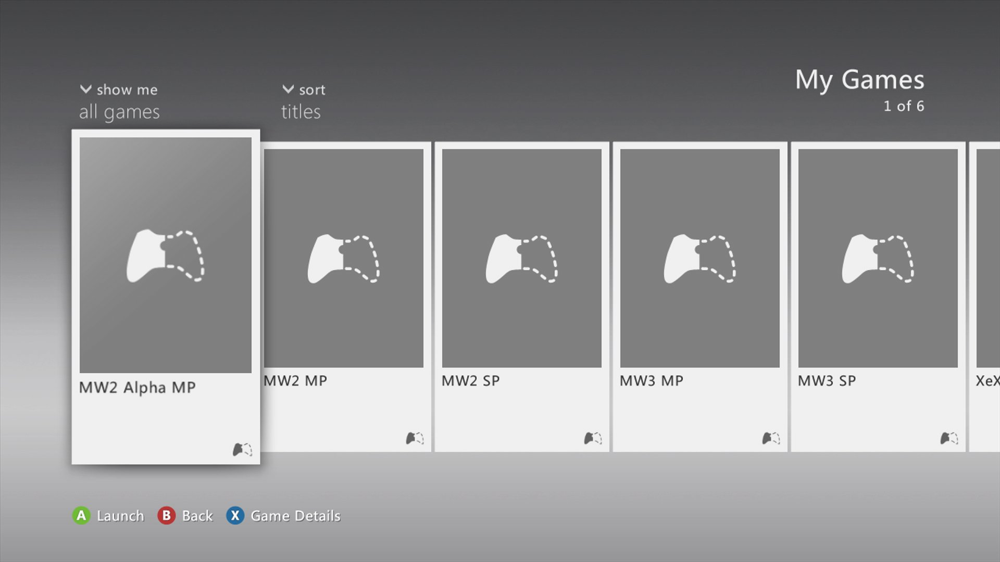

# GameShortcut
GameShortcut is a utility to build shortcuts to games in the Games section of the regular Xbox 360 dashboard. The main purpose of GameShortcut is to avoid opening XeXMenu and browsing your files to launch a game.



## Prerequisites
- Having the Xbox 360 Software Development Kit installed
- Xbox 360 Neighborhood set up with your RGH/Jtag/Devkit registered as the default console

## How to use
- Download the latest release in the [releases section](https://github.com/ClementDreptin/GameShortcut/releases).
- Modify `config\shortcutInfo.txt` and respect the following format
    ```
    <shortcut_name>
    <path_to_xex>
    ```
- Run `Publisher.exe`
- Reboot your console and go the Games section of your dashboard to see your shortcut

## How it works
This project is split in two. The first part is the shortcut application itself (that runs on the console) and the second part is a Windows console application (that runs on a computer) to build the shortcut and send it to the console.

The shortcut application is a regular XEX file, so not exactly a shortcut just yet. All it does is reading the `config\shortcutInfo.txt` file to get the path to the XEX file the shortcut is made for and launches it.

The Windows console application creates an XML configuration file from the name of the shortcut in `config\shortcutInfo.txt` and builds a Demo game for it with BLAST (console application provided with the XDK). BLAST takes care of deploying the Demo game to the console in the right directory. When the operation completes (successfully or not), the XML configuration file and the files generated by BLAST are deleted automatically.

## Building
To build from source, open `GameShortcut.sln` in Visual Studio. The two projects have separate target platforms, `GameShortcut` only builds for the `Xbox 360` platform and `Publisher` only builds for the `Win32` platform. The building workflow differs depending on your version of Visual Studio.

- Visual Studio 2019 and prior: Select the `Xbox 360` platform and build `GameShortcut` then select the `Win32` platform and build `Publisher`.
- Visual Studio 2022: You can't build with the 64-bit version of MSBuild so you'll need to run the 32-bit version manually. Open a developer powershell in Visual Studio (`View > Terminal`) and run the following commands:
    - ```PS1
        # Create an alias to the 32-bit version of MSBuild named msbuild
        Set-Alias msbuild <path_vs2022>\MSBuild\Current\Bin\MSBuild.exe
      ```
    - ```PS1
        # Build GameShortcut
        msbuild /p:Configuration=Release`;Platform="Xbox 360"
      ```
    - ```PS1
        # Build Publisher
        msbuild /p:Configuration=Release`;Platform=Win32
      ```

If you want to run `Publisher` within Visual Studio, you will need to set it as the startup project. Once it's done, you can run `Publisher` by pressing `F5`.
